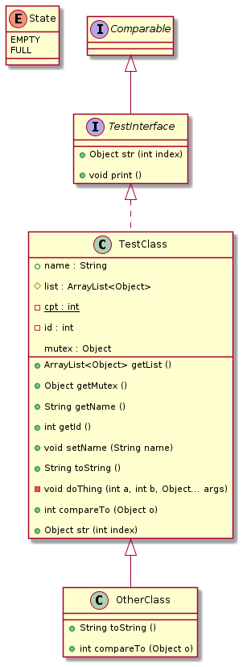

# javatouml

Convert java code to uml diagram

## Version

1. __Version 0.1__

- Input:
  - java class

- Output:
  - plantuml code

## How to run

Clone the project with the following command:

```sh
git clone https://github.com/Amayas29/javatouml
```

- make sure you are in the javatouml directory *(with `cd` command)*

then start the program with the following command:

```sh
make FILENAME="Your java source filename"
```

## Example

let this java file

```java
import java.util.ArrayList;

enum State {
  EMPTY, FULL;
}

public class TestClass implements TestInterface {

  public String name;
  protected ArrayList<Object> list;
  private static int cpt = 0;
  private final int id;
  Object mutex;

  public TestClass(String name, ArrayList<Object> list) {
    this.name = name;
    this.list = list;
    this.mutex = new Object();
    id = cpt++;
  }

  public final ArrayList<Object> getList() {
    return list;
  }

  public Object getMutex() {
    return mutex;
  }

  public String getName() {
    return name;
  }

  public int getId() {
    return id;
  }

  public void setName(String name) {
    this.name = name;
  }

  @Override
  public String toString() {
    doThing(0, 0);
    return "TestClass";
  }

  private void doThing(int a, int b, Object... args) {
    // do something
  }

  @Override
  public int compareTo(Object o) {
    return 0;
  }

  @Override
  public Object str(int index) {
    return null;
  }

}

class OtherClass extends TestClass {
  public OtherClass(String name) {
    super(name, null);
  }

  @Override
  public String toString() {
    return super.toString();
  }

  @Override
  public int compareTo(Object o) {
    return 1;
  }
}

interface TestInterface extends Comparable<Object> {

  public Object str(int index);

  default public void print() {
    System.out.println("default");
  }
}
```

We get the following plantuml code

```'
@startuml

skinparam groupInheritance 2

enum State {
 EMPTY
 FULL
}

class TestClass implements TestInterface {
 + name : String 

 # list : ArrayList<Object> 

 - {static} cpt : int 

 - id : int 

 mutex : Object 

 + ArrayList<Object> getList ()

 + Object getMutex ()

 + String getName ()

 + int getId ()

 + void setName (String name)

 + String toString ()

 - void doThing (int a, int b, Object... args)

 + int compareTo (Object o)

 + Object str (int index)

}

class OtherClass extends TestClass {
 + String toString ()

 + int compareTo (Object o)

}

interface TestInterface extends Comparable {
 + Object str (int index)

 + void print ()

}

@enduml
```

And this is the diagram



## TODO

- __Version 0.2__
  
  - [ ] Change the input data : get an java project and generate the Corresponding plantuml code
  
    - java class ==> java project

  - [ ] Change the way that input is passed to the program
  
    - filename  in command line argument ==> An GUI choose directory/file
